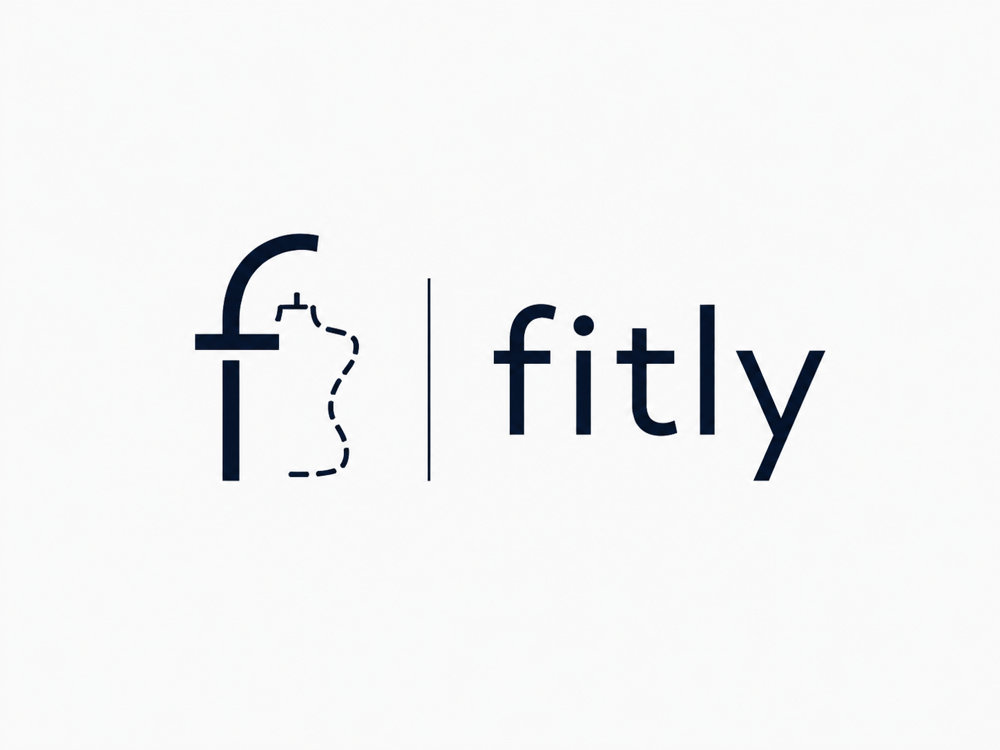

# 오늘 뭐 입지? : FITLY

<p align="center">
  
</p>

Vue 3와 Spring Boot로 만든 미니 프로젝트용 풀스택 스캐폴딩입니다. 아이디어 메모를 등록하고, 향후 실제 AI API로 교체할 수 있는 Mock 요약 API를 호출합니다.


## Pain Point
사용자는 특정 상황에 어떤 옷을 입어야 할지 결정하기 어렵고, 한두 번 입을 옷을 새로 구매하기에는 비용과 활용도 측면에서 부담을 느낀다.

- 1.고객의 3대 핵심 페인 포인트 (reference)
    1. **[조합의 한계] 내 옷과 어울리는 코디 매칭의 어려움**
        - 새 옷을 구매해도 옷장에 있는 기존 바지나 외투와 색상/실루엣이 맞지 않아 
        옷장에 방치되는 문제 (매칭 실패율 60% 이상).
    2. **[취향 길잡이 부재] 원하는 스타일 구현의 갈증**
        - 미니멀, 스트릿, 아메카지 등 원하는 무드는 있으나 패션 전문 지식 부족으로 
        완성도 높은 조합을 찾기 위해 쇼핑몰에서 2~3시간씩 낭비하는 문제.
    3. **[비합리적 소비] 사기엔 애매한 1회성 특수 의류의 비용 낭비**
        - 면접 정장(취업 후 불필요), 결혼식 하객룩(연 1~2회 착용), 
        원데이 작업복/실습복 등 1회성 착용을 위해 수십만 원을 지출하는 구조적 비효율.

## Actor
### User

- 서비스를 이용하여 상황에 맞는 코디를 추천받고 의류를 대여하는 사용자

### Admin

- 서비스에서 제공하는 의류와 대여 정보를 관리하는 관리자

## 주요 Use-Case

- 상세 내용
    
    ### 📋 UC-01: 내 옷 사진 업로드 & TPO 상황 입력
    
    - **주 액터**: 일반 사용자 (Customer) / **보조 액터**: AI 비전 엔진
    - **사전 조건**: 사용자가 오늘 뭐 입지? AI 웹 서비스에 접속한 상태
    - **기본 흐름 (Main Flow)**:
        1. 사용자가 TPO 상황(비즈니스 면접, 결혼식 하객, 원데이 작업복, 일상복)을 선택한다.
        2. 사용자가 선호 스타일 태그(미니멀, 포멀, 스트릿)를 선택한다.
        3. 사용자가 보유 중인 옷 사진(예: 블랙 슬랙스)을 업로드하거나 텍스트를 입력한다.
        4. 프론트엔드가 이미지 썸네일 미리보기를 즉시 렌더링한다.
        5. `[AI 맞춤 코디 & 대여 추천받기]` 버튼을 클릭하여 비동기 분석을 요청한다.
    - **AI-Ready 확장 지점**: 업로드된 이미지 파일(URL)을 AI Vision 프롬프트의 입력으로 바인딩.
    
    ---
    
    ### 📋 UC-02: AI 맞춤 코디 큐레이션 및 추천 결과 조회
    
    - **주 액터**: 일반 사용자 (Customer) / **보조 액터**: AI 스타일리스트
    - **사전 조건**: UC-01의 비동기 분석 작업이 완료(`COMPLETED`)된 상태
    - **기본 흐름 (Main Flow)**:
        1. 백엔드 Mock Controller가 사전에 정의된 고품질 JSON Schema 데이터를 비동기로 반환한다.
        2. 화면에 AI 비전 인식 결과(색상: Deep Black, 카테고리: 슬랙스)가 표시된다.
        3. 매칭 점수(96점)와 AI 코디네이터 스타일링 코멘트(Reasoning Box)가 렌더링된다.
        4. 추천 의류 2종(자켓 + 셔츠)의 사진, 브랜드, 단건 대여가(28,000원), 정가 대비 할인율을 확인한다.
    - **AI-Ready 확장 지점**: AI Vision 인식 메타데이터와 추천 의류 리스트를 화면 DTO에 1:1 매핑.
    
    ---
    
    ### 📋 UC-03: 단건 의류 대여 신청 및 결제
    
    - **주 액터**: 일반 사용자 (Customer) / **보조 액터**: 플랫폼 관리자
    - **기본 흐름 (Main Flow)**:
        1. 사용자가 추천 카드에서 `[단건 대여 신청]` 버튼을 클릭한다.
        2. 대여 기간(3박 4일: 수령일 ~ 자동 반납일)과 결제 금액(28,000원) 모달이 팝업된다.
        3. 배송지 주소를 입력하고 단건 결제를 승인한다.
        4. 시스템이 주문을 DB에 저장하고 대여 접수 완료 토스트를 노출한다.
    
    ---
    
    ### 📋 UC-04: 대여 의류 카탈로그 및 주문 관제
    
    - **주 액터**: 플랫폼 관리자 (Admin)
    - **기본 흐름 (Main Flow)**:
        1. 관리자가 대여 가능한 무신사 의류(상품명, 카테고리, 단건 대여가, 정가, 이미지 URL, 재고)를 
        등록한다.
        2. 실시간 대여 주문 건과 반납 일정을 모니터링한다.

  | Use-Case | 설명 | AI 적용 |
| --- | --- | --- |
| 회원가입 / 로그인 | 서비스 이용을 위한 사용자 인증 | X |
| 상황 선택 | 면접, 결혼식, 데이트, 여행 등 상황 선택 | X |
| 추천 조건 입력 | 계절, 스타일, 색상, 예산 등 조건 입력 | X |
| 코디 추천 요청 | 입력된 상황과 조건을 기반으로 코디 추천 | O |
| 추천 코디 조회 | 추천된 코디와 구성 상품 확인 | O |
| 상품 상세 조회 | 가격, 사이즈, 설명, 재고 등 확인 | X |
| 대여 가능 여부 확인 | 선택한 기간에 상품 대여 가능 여부 확인 | X |
| 상품 대여 | 상품, 사이즈, 기간을 선택하여 대여 신청 | X |
| 대여 내역 조회 | 현재 및 과거 대여 내역 확인 | X |


## 구성

- Frontend: Vue 3, Vite
- Backend: Java 21, Spring Boot 3, Spring Data JPA
- Database: Supabase PostgreSQL(운영), H2(in-memory, 로컬 개발 및 테스트)
- Image Storage: Supabase Storage
- API 문서: springdoc-openapi 및 Swagger UI (`/swagger-ui.html`)
- CI: GitHub Actions에서 frontend build 및 backend test

## 기술 스택 선정 이유

### Frontend - Vue 3 + Vite

Vue 3는 컴포넌트 단위로 화면을 분리하기 쉬우며 반응형 상태 관리를 지원한다. FITLY에서는 상황 및 스타일 입력, 의류 이미지 미리보기, AI 분석 진행 상태, 추천 상품 카드와 대여 모달처럼 상태 변화가 많은 화면을 구성해야 하므로 Vue의 컴포넌트 기반 구조가 적합하다. Vite는 개발 서버 실행과 빌드가 빠르기 때문에 3일이라는 짧은 프로젝트 기간에 화면을 신속하게 구현하고 검증하는 데 유리하다.

### Backend - Spring Boot

FastAPI는 Python 기반으로 AI 모델이나 Python 생태계와 직접 결합할 때 유리하고, 적은 코드로 비동기 API를 빠르게 만들 수 있다. 그러나 FITLY의 핵심 백엔드는 AI 모델 자체보다 회원, 상품, 재고, 추천 결과, 주문, 결제 및 반납 일정처럼 서로 연관된 비즈니스 데이터를 안정적으로 처리하는 역할에 가깝다.

Spring Boot를 선택한 이유는 다음과 같다.

- **도메인 확장성**: Controller-Service-Repository 계층을 분리하여 추천, 상품, 재고, 대여 주문 등의 기능을 독립적으로 확장할 수 있다.
- **데이터 정합성**: Spring Data JPA와 트랜잭션 기능을 활용하여 주문 생성과 재고 차감처럼 함께 성공하거나 실패해야 하는 처리를 안전하게 구현할 수 있다.
- **검증 및 예외 처리**: Bean Validation과 공통 예외 처리를 이용하여 FE에 일관된 오류 응답을 제공할 수 있다.
- **보안 확장성**: 이후 Spring Security와 Supabase Auth의 JWT 검증을 결합하여 사용자와 관리자 권한을 구분할 수 있다.
- **AI 구현 격리**: AI 호출부를 Provider 인터페이스 뒤에 분리하면 현재 Mock 구현을 실제 Vision/LLM API로 교체해도 주문 및 상품 로직과 Frontend API 규격을 유지할 수 있다.
- **운영 안정성**: 외부 설정, 상태 확인, 모니터링 등 운영에 필요한 기능을 Spring 생태계로 확장하기 쉽다.

따라서 FITLY는 AI 분석 요청을 포함하지만, 서비스 전체의 중심은 대여 도메인과 데이터 정합성이므로 Spring Boot를 주 백엔드로 사용한다. 추후 별도의 Python AI 모델 서버가 필요해지면 FastAPI를 AI 전용 마이크로서비스로 추가하고 Spring Boot가 이를 호출하는 구조로 확장할 수 있다.

### API 명세 - OpenAPI와 springdoc-openapi

**OpenAPI Specification(OAS)**은 REST API의 주소, HTTP Method, 요청값, 응답 JSON, 상태 코드 등을 기계가 읽을 수 있는 표준 형식으로 표현하는 명세이다. **springdoc-openapi**는 Spring Boot Controller와 DTO 정보를 분석하여 OpenAPI 문서를 자동으로 생성하고, 이를 Swagger UI에서 사람이 확인하고 직접 호출해볼 수 있게 해주는 라이브러리다.

FITLY에서 이를 사용하는 이유는 다음과 같다.

- Frontend와 Backend가 추천 요청 및 결과 JSON 규격을 동일하게 이해할 수 있다.
- 실제 AI가 없는 단계에서도 Mock API의 요청과 응답 구조를 먼저 확정할 수 있다.
- `PENDING`, `COMPLETED`, `FAILED` 상태와 추천 결과 DTO를 문서화하여 비동기 연동 오류를 줄일 수 있다.
- Postman 컬렉션이나 테스트 클라이언트 생성에 활용할 수 있다.
- 발표 시 `/swagger-ui.html`에서 구현된 API와 응답을 바로 시연할 수 있다.

OpenAPI는 **API 표준 문서 형식**, springdoc-openapi는 **Spring Boot 코드에서 그 문서를 생성하는 도구**, Swagger UI는 **생성된 문서를 웹 화면으로 보여주고 테스트하는 도구**라는 차이가 있다.

### Database - Supabase PostgreSQL

Supabase는 단순한 데이터베이스 이름이 아니라 관리형 PostgreSQL을 중심으로 Auth, Storage, Realtime 등의 기능을 제공하는 Backend-as-a-Service다. FITLY의 운영 데이터는 Supabase PostgreSQL에 저장하고, 로컬 단위·통합 테스트에서는 빠르고 독립적인 실행을 위해 H2를 사용한다.

Supabase를 선택한 이유는 다음과 같다.

- **빠른 구축**: 별도 DB 서버 설치 없이 팀원이 동일한 Cloud PostgreSQL을 사용할 수 있다.
- **관계형 모델 적합성**: 사용자-상품-추천-대여 주문-주문 상품 간 관계와 재고를 Foreign Key 및 Transaction으로 관리할 수 있다.
- **관리 편의성**: Dashboard의 Table Editor와 SQL Editor로 데이터와 스키마를 쉽게 확인할 수 있어 짧은 프로젝트와 시연에 적합하다.
- **이미지 저장**: 사용자가 업로드한 보유 의류 사진과 상품 이미지는 DB에 직접 넣지 않고 Supabase Storage에 보관한 뒤 URL과 메타데이터만 PostgreSQL에 저장할 수 있다.
- **인증 확장**: 향후 Supabase Auth를 도입하면 JWT 기반 로그인과 사용자별 데이터 접근 제어로 확장할 수 있다.

Spring Boot는 Supabase가 제공하는 PostgreSQL 연결 문자열을 환경변수로 받아 JDBC/JPA로 접속한다. DB 비밀번호와 서비스 키는 소스코드에 기록하지 않고 로컬 환경변수 및 GitHub Secrets로 관리한다. Vue Frontend에서 관리자용 Service Role Key를 직접 사용하는 방식은 피한다.

### 전체 구성

```text
Vue 3 + Vite
      │ REST API / JSON
      ▼
Spring Boot ── springdoc-openapi / Swagger UI
      │ JPA / JDBC
      ├── Supabase PostgreSQL: 사용자, 상품, 추천, 주문, 재고
      └── Supabase Storage: 보유 의류 및 상품 이미지
      │
      └── Mock AI Provider → 실제 Vision/LLM Provider로 교체
```

## 실행

### Backend

JDK 21이 필요합니다. Maven은 wrapper가 자동으로 준비합니다.

로컬 H2 DB로 실행:

```bash
cd backend
./mvnw spring-boot:run
```

- API: http://localhost:8080/api
- Swagger UI: http://localhost:8080/swagger-ui.html
- H2 Console: http://localhost:8080/h2-console
  - JDBC URL: `jdbc:h2:mem:minip`
  - User: `sa`
  - Password: 없음

Supabase PostgreSQL로 실행:

1. Supabase Dashboard의 `Connect`에서 **Session pooler** 접속 정보를 확인한다.
2. 저장소 루트의 `.env.example`을 `.env`로 복사하고 실제 값을 입력한다.
3. `.env`를 현재 터미널에 불러온 뒤 `supabase` 프로필로 Backend를 실행한다.

```bash
cp .env.example .env
set -a
source .env
set +a
cd backend
./mvnw spring-boot:run
```

Spring Boot는 `SPRING_PROFILES_ACTIVE=supabase` 값을 읽어 `application-supabase.yml` 설정을 사용한다. `.env`에는 DB 비밀번호가 포함되므로 Git에 커밋하지 않는다.

| 환경변수 | 설명 |
| --- | --- |
| `SUPABASE_DB_URL` | `jdbc:postgresql://`로 시작하는 Session pooler JDBC URL |
| `SUPABASE_DB_USERNAME` | 일반적으로 `postgres.PROJECT_REF` 형식인 DB 사용자명 |
| `SUPABASE_DB_PASSWORD` | Supabase 프로젝트의 Database Password |
| `JPA_DDL_AUTO` | 개발 단계 기본값 `update`; 운영 안정화 후 `validate` 권장 |

### Frontend

```bash
cd frontend
npm install
npm run dev
```

브라우저에서 http://localhost:5173 을 엽니다. Vite 개발 서버가 `/api` 요청을 Spring Boot로 프록시합니다.

## 핵심 API

| Method | Path | 설명 |
| --- | --- | --- |
| GET | `/api/notes` | 메모 목록 조회 |
| POST | `/api/notes` | 메모 등록 |
| POST | `/api/notes/{id}/ai-summary` | 비동기 AI 요약 작업 생성(Mock) |
| GET | `/api/ai-jobs/{jobId}` | AI 작업 상태/결과 조회 |

AI 연동부는 `AiSummaryProvider` 인터페이스 뒤에 격리했습니다. 실제 모델을 붙일 때 구현체만 교체하고 기존 JSON 응답 규격은 유지할 수 있습니다.

## 다음 단계

1. 팀 서비스 주제에 맞게 `Note` 도메인과 화면 문구 변경
2. FITLY 도메인 테이블 설계 및 Supabase Storage 연결
3. 실제 AI Provider 구현 및 API Key를 환경변수/GitHub Secret으로 주입

## 배포 및 CD

FITLY는 **Render Web Service 한 개**에 Docker로 통합 배포한다. Docker 빌드 과정에서 Vue를 정적 파일로 빌드한 뒤 Spring Boot 애플리케이션 안에 포함하므로 Frontend와 Backend가 동일한 도메인을 사용한다. 데이터는 외부 Supabase PostgreSQL에 저장한다.

```text
GitHub main push
  → GitHub Actions CI (Vue build + Spring Boot test)
  → CI 성공
  → Render Auto-Deploy
  → Docker에서 Vue + Spring Boot 빌드
  → FITLY Web Service 실행
  → Supabase PostgreSQL 연결
```

### 최초 1회 Render 연결

1. [Render Dashboard](https://dashboard.render.com/)에서 GitHub 계정을 연결한다.
2. `New` → `Blueprint`를 선택하고 `w-000000/fitly` 저장소를 연결한다.
3. 저장소 루트의 `render.yaml`을 인식시키고 다음 Secret 값을 입력한다.

| Render 환경변수 | 입력값 |
| --- | --- |
| `SUPABASE_DB_URL` | `jdbc:postgresql://`로 시작하는 Supabase Session pooler URL |
| `SUPABASE_DB_USERNAME` | Supabase Session pooler 사용자명 |
| `SUPABASE_DB_PASSWORD` | Supabase Database Password |

4. Blueprint를 적용하고 최초 배포가 완료될 때까지 Events와 Logs를 확인한다.
5. 배포된 `https://fitly-....onrender.com/` 주소와 `/actuator/health` 응답을 확인한다.

이후에는 `main`에 push하고 GitHub Actions 검사가 성공하면 Render가 자동으로 새 Docker 이미지를 빌드하고 배포한다. `render.yaml`에는 Secret의 이름만 있으며 실제 비밀번호는 Render Dashboard에 저장되므로 Git에 노출되지 않는다.

> Render Free Web Service는 일정 시간 요청이 없으면 대기 상태로 전환되므로 첫 접속이 느릴 수 있다. 수업 데모 직전에는 URL에 미리 접속해 서비스를 깨워두는 것이 좋다.
