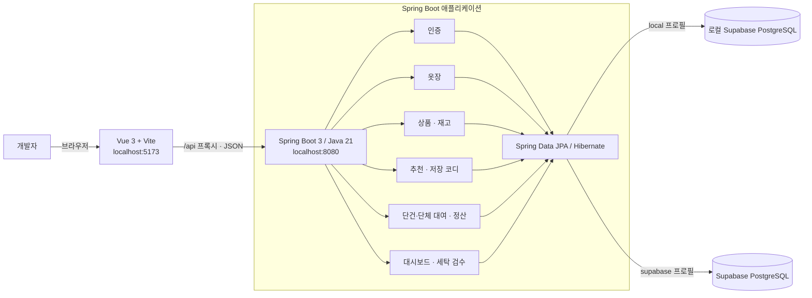
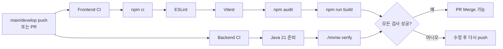

# FITLY 개발 아키텍처

이 문서는 현재 저장소의 구현을 기준으로 로컬 개발, 애플리케이션 구성, 데이터 저장, CI와 배포 흐름을 설명한다.

## 1. 아키텍처 개요



- 프론트엔드는 Vue Router를 사용하는 SPA이며 `/api` 상대 경로로 백엔드를 호출한다.
- 로컬에서는 Vite가 `/api` 요청을 `localhost:8080`으로 프록시한다.
- 운영에서는 Vue 빌드 결과가 Spring Boot JAR의 정적 리소스에 포함되어 화면과 API가 같은 도메인에서 제공된다.
- 백엔드는 REST Controller, 도메인 로직, Spring Data JPA Repository로 구성된다.
- 로컬 개발은 Supabase CLI의 PostgreSQL, 운영은 Supabase PostgreSQL을 사용한다.
- 자동화 테스트만 외부 DB와 격리된 H2 PostgreSQL 호환 모드를 사용한다.

## 2. 로컬 개발 흐름

```text
브라우저 http://localhost:5173
       │
       │ 화면 요청
       ▼
Vite 개발 서버 ───────────── Vue 소스의 빠른 갱신(HMR)
       │
       │ /api 요청 프록시
       ▼
Spring Boot http://localhost:8080
       │
       ├── /api/**             REST API
       ├── /swagger-ui/**      API 문서 및 호출 화면
       ├── /v3/api-docs        OpenAPI JSON
       └── /actuator/health    상태 확인
               │
               ▼
       로컬 PostgreSQL :54322
```

개발 시에는 프론트엔드와 백엔드를 별도 프로세스로 실행한다.

```bash
# 터미널 1
npx --yes supabase@2.116.0 start
npx --yes supabase@2.116.0 db reset --local
cd backend
./mvnw spring-boot:run

# 터미널 2
cd frontend
npm ci
npm run dev
```

H2는 애플리케이션을 종료하면 데이터가 사라진다. 팀 공유 데이터나 운영 데이터가 필요할 때만 `supabase` 프로필과 환경변수를 사용한다.

## 3. 프론트엔드 구성

```text
frontend/src/
├── main.js             Vue 앱과 Router 시작
├── App.vue             공통 애플리케이션 레이아웃
├── router/index.js     /, /recommend 라우팅
├── views/              페이지 단위 컴포넌트
├── components/         재사용 UI 컴포넌트
├── api.js              fetch 기반 REST API 호출
└── style.css           공통 스타일
```

현재 UI가 직접 호출하는 API는 `POST /api/recommendations`이다. 백엔드에는 인증, 옷장, 상품, 대여, 세탁 API도 구현되어 있으므로 해당 화면과 API 클라이언트는 후속 연결 대상이다.

## 4. 백엔드 도메인 구성

| 패키지 | 책임 | 주요 저장 데이터 |
| --- | --- | --- |
| `auth` | 회원가입, BCrypt 비밀번호 검증, 세션 토큰 발급 | `UserAccount`, `AuthSession` |
| `wardrobe` | 고객 보유 의류와 이미지 등록·조회·수정·삭제 | `WardrobeItem` |
| `catalog` | 제휴사 상품, 사이즈별 재고, 기간별 대여 가능 여부 | `Product`, `ProductVariant` |
| `recommendation` | 조건 기반 추천, Mock 추천 작업과 코디 저장·해제 | `RecommendationJob`, `SavedOutfit` |
| `rental` | 단건·단체 대여, 반납, 소장 전환, 매출·정산 | `RentalOrder`, `GroupRentalRequest` |
| `laundry` | 반납 상품의 파손·세탁 검수와 재고 복구 | `LaundryInspection` |
| `dashboard` | 관리자 KPI·최근 주문 및 제휴사 상품·재고·매출 요약 | 조회 전용 응답 DTO |
| `config` | 역할 검사, CORS, 공통 예외 응답 | - |

요청 처리의 기본 방향은 다음과 같다.

```text
HTTP 요청
  → Controller: 입력 검증, 역할·소유권 검사, 응답 변환
  → Service: 여러 규칙과 저장 작업을 묶는 비즈니스 로직
  → Repository: JPA를 통한 데이터 조회·저장
  → Database
```

현재는 `recommendation`의 조건 기반 추천에 별도 Service가 있고, 다른 일부 도메인은 Controller가 Repository를 직접 호출한다. 기능이 커지거나 여러 저장 작업을 하나의 트랜잭션으로 묶어야 할 때 도메인별 Service로 로직을 이동한다.

### 인증과 권한의 현재 상태

- 회원 비밀번호는 BCrypt 해시로 저장하고 로그인 시 DB 세션 토큰을 발급한다.
- 역할 제한 API는 개발 단계의 `X-Actor-Role` 헤더를 검사한다.
- 고객 소유권 제한에는 `X-User-Id` 헤더를 함께 사용한다.
- 현재 발급한 Bearer 토큰과 역할 헤더 검사는 아직 하나의 인증 필터로 연결되어 있지 않다.
- 운영 전에는 Spring Security에서 Bearer 토큰 또는 Supabase Auth JWT를 검증하고, 검증된 사용자 ID와 역할만 Controller에 전달해야 한다.

### 이미지 저장의 현재 상태

옷장 이미지는 현재 Data URL을 `wardrobe_item.image_url`에 저장하고 이미지 조회 API로 제공한다. Supabase Storage 연동은 목표 구조이며 아직 구현되지 않았다. 운영 단계에서는 이미지 원본을 Object Storage에 저장하고 DB에는 URL과 메타데이터만 저장하는 방식으로 전환한다.

## 5. 데이터 환경

| 환경 | Spring 프로필 | 데이터베이스 | 스키마 설정 | 목적 |
| --- | --- | --- | --- | --- |
| 로컬 개발 | `local` | Supabase CLI PostgreSQL | `public`, `validate` | 운영과 같은 PostgreSQL 스키마 검증 |
| 자동화 테스트 | `test` | H2 PostgreSQL mode | `public`, `create-drop` | 빠르고 독립적인 테스트 |
| Render 운영 | `supabase` | Supabase PostgreSQL | `public`, `validate` | 팀 공유 및 운영 데이터 보존 |

운영 DB 접속 정보는 `SUPABASE_DB_URL`, `SUPABASE_DB_USERNAME`, `SUPABASE_DB_PASSWORD` 환경변수로 주입하며 저장소에 커밋하지 않는다. 스키마 변경은 `supabase/migrations`로만 관리하고 Hibernate는 항상 `ddl-auto=validate`를 사용한다.

## 6. CI 흐름



- Frontend CI는 패키지 설치, ESLint, Vitest 단위 테스트, 운영 의존성 보안 감사와 Vue 빌드를 실행한다.
- Backend CI는 Java 코드 컴파일, JUnit/Spring 통합 테스트와 Checkstyle 검사를 `mvn verify`로 실행한다.
- Browser CI는 Playwright로 Chromium, Firefox, WebKit과 모바일 Chromium에서 이동, API 결과 표시와 가로 화면 넘침을 확인한다.
- Security CI는 CodeQL로 Java와 JavaScript 코드를 정적 분석한다. npm 운영 의존성은 Frontend CI의 `npm audit`에서 high 이상 취약점을 차단한다.
- GitHub Ruleset에서 `build`, `test`, `browser-test`와 CodeQL 검사를 필수 상태 검사로 지정해야 실패한 코드를 실제로 Merge하지 못하게 막을 수 있다.

### GitHub Actions와 Ruleset

GitHub Actions는 GitHub가 제공하는 자동화 실행 플랫폼이며, `.github/workflows/*.yml` 파일에 실행 시점과 작업을 정의한다. CI는 제품명이 아니라 자동 빌드·테스트 방식의 이름이다. Jenkins, GitLab CI/CD 등으로도 CI를 구성할 수 있지만 FITLY는 GitHub Actions를 CI 도구로 사용한다.

현재 워크플로는 다음 네 개다.

| Workflow | Job 이름 | 실행 내용 |
| --- | --- | --- |
| `Frontend CI` | `build` | npm 설치 → ESLint → Vitest → npm audit → Vue build |
| `Backend CI` | `test` | Java 21 → Maven test/package → Checkstyle |
| `Browser CI` | `browser-test` | Chromium, Firefox, WebKit, 모바일 Chromium E2E |
| `Security CI` | `codeql (java-kotlin)` 등 | Java/JavaScript 정적 보안 분석 |

Ruleset은 CI를 실행하는 도구가 아니라 GitHub의 Merge 보호 설정이다. `main` 또는 `develop`에 PR 필수, 필수 CI 통과, 삭제·force push 금지 등을 설정할 수 있다. Ruleset은 GitHub 서버의 저장소 설정이므로 이 저장소 파일만으로 실제 활성화 여부를 확인할 수 없으며 `Settings → Rules → Rulesets`에서 확인한다.

### CI는 어떤 코드를 검사하는가

CI는 push 또는 PR에 포함된 **동일한 애플리케이션 소스 코드**를 GitHub의 깨끗한 Ubuntu 실행 환경에 checkout하여 검사한다. 별도의 CI용 운영 코드를 만드는 것은 아니다. 다만 안전하고 반복 가능한 검사를 위해 외부 환경은 운영과 다르게 격리한다.

| 검사 | 사용하는 코드 | 운영과 다른 부분 |
| --- | --- | --- |
| Frontend lint/build | 실제 Vue 소스 | 배포하지 않고 정적 분석과 빌드만 수행 |
| Frontend 단위 테스트 | 실제 Vue 컴포넌트 | API 함수는 Mock 응답 사용 |
| Browser E2E | 실제 Vue 앱 | 추천 API 요청은 Playwright가 Mock 응답 |
| Backend 통합 테스트 | 실제 Spring Boot 코드 | Supabase 대신 H2 인메모리 DB 사용 |
| CodeQL | 실제 Java/JavaScript 소스 | 실행 결과가 아니라 코드 패턴을 정적 분석 |

따라서 CI 통과는 동일한 코드의 주요 동작을 검증했다는 뜻이지만, 실제 Supabase 연결, Render 네트워크와 모든 운영 데이터까지 동일하다는 뜻은 아니다. 배포 후에는 Render의 `/actuator/health` 검사와 별도의 운영 smoke test가 이를 보완한다.

## 7. Render 배포 구조

```mermaid
flowchart LR
    GIT[GitHub main] -->|CI 성공| RENDER[Render Blueprint]
    RENDER --> DOCKER[Docker multi-stage build]
    DOCKER --> NODE[Node 22<br/>Vue build]
    DOCKER --> MAVEN[Maven + Java 21<br/>Spring Boot package]
    NODE --> JAR[Vue 정적 파일을 포함한 JAR]
    MAVEN --> JAR
    JAR --> APP[Java 21 컨테이너<br/>port 8080]
    APP --> HEALTH[/actuator/health]
    APP --> DB[(Supabase PostgreSQL)]
    USER[사용자] -->|HTTPS, 동일 도메인| APP
```

Render는 저장소의 `render.yaml`에서 `runtime: docker`와 `dockerfilePath: ./Dockerfile`을 확인한다. 이어서 Dockerfile의 multi-stage 명령으로 Vue와 Spring Boot를 빌드해 Docker 이미지를 만들고, 그 이미지로 컨테이너를 실행한다.

```text
GitHub 저장소의 Dockerfile
        ↓ Render가 읽고 build
Docker Image
        ↓ Render가 실행
Docker Container
        ↓
Spring Boot + Vue 정적 파일
```

Dockerfile의 최종 결과는 Vue 정적 파일과 REST API를 함께 제공하는 실행 이미지 하나이다. Render는 이 이미지로 Web Service 컨테이너를 실행하고 `/actuator/health`로 상태를 확인한다. 따라서 아키텍처에서는 단순히 “Docker”라고만 쓰기보다 “Dockerfile Build”, “Docker Image/Container”로 단계를 구분한다.

### Secret의 저장 위치

현재 GitHub Actions 워크플로는 Supabase에 연결하거나 운영 배포를 직접 수행하지 않으므로 Supabase Secret을 사용하지 않는다. 아래 세 값은 `render.yaml`에 이름만 선언되어 있고 실제 값은 Render Dashboard에 입력한다.

- `SUPABASE_DB_URL`
- `SUPABASE_DB_USERNAME`
- `SUPABASE_DB_PASSWORD`

`sync: false`는 Blueprint 파일에 실제 값을 저장하지 않고 Render에서 사용자가 안전하게 입력하도록 한다는 뜻이다. 비밀번호를 `render.yaml`, `.env.example`, GitHub 저장소 또는 아키텍처 그림에 실제 값으로 기록하지 않는다. 향후 GitHub Actions가 배포 명령을 직접 수행하게 될 때만 필요한 배포 자격 증명을 GitHub Actions Secrets에 별도로 등록한다.

## 8. 브라우저 호환성

운영 환경에서는 Spring Boot가 동일한 HTML, JavaScript, CSS를 모든 브라우저에 내려준다. 브라우저별 서버나 별도 배포는 필요하지 않다. Chrome, Edge, Whale은 Chromium 기반이고 현재 프로젝트가 사용하는 Vue 3, Vue Router, `fetch` API는 최신 Firefox를 포함한 현대적인 브라우저에서 일반적으로 지원된다.

Browser CI는 실제 브라우저 엔진에서 홈→추천 화면 이동, Mock API 응답 표시, 핵심 영역 노출과 가로 화면 넘침 여부를 확인한다. 이는 주요 흐름의 회귀를 막는 최소 검사이며 모든 화면의 픽셀 단위 디자인이나 실제 Chrome·Edge·Whale·Safari 제품 버전을 전부 검증하는 것은 아니다.

지원 범위를 보장하려면 다음을 추가한다.

1. 지원 대상을 최신 Chrome, Edge, Whale, Firefox와 Safari로 명시한다.
2. 중요한 사용자 흐름이 늘어날 때 Playwright 시나리오도 함께 추가한다.
3. 디자인 변경에 픽셀 단위 회귀 검사가 필요하면 기준 스크린샷을 관리한다.
4. 오래된 브라우저 지원이 요구될 때만 별도 legacy 빌드 또는 polyfill을 검토한다.

## 9. Kubernetes로 확장할 경우

현재 단일 인스턴스 규모에서는 Render가 더 단순하다. Kubernetes가 요구될 경우 Dockerfile은 유지하고 Render의 책임을 다음 리소스로 교체한다.

| 현재 Render 기능 | Kubernetes 대응 |
| --- | --- |
| Docker 컨테이너 실행 | `Deployment` |
| 고정 서비스 주소 | `Service` |
| 외부 HTTPS 연결 | `Gateway` 또는 `Ingress` |
| 환경변수와 비밀번호 | `ConfigMap`, `Secret` |
| `/actuator/health` 검사 | startup/readiness/liveness probe |
| 자동 재시작과 복제 | Deployment controller, replica |

이미지는 GitHub Actions에서 빌드하여 GHCR 같은 Registry에 올린 뒤 Kubernetes가 pull하도록 구성한다. 다중 replica를 적용하기 전에는 DB 마이그레이션, 초기 데이터 동시 생성, Supabase 연결 수, 인증 세션의 공유 여부를 먼저 검증해야 한다.

## 10. 권장 후속 작업

1. Bearer 토큰을 검증하는 Spring Security 인증 계층을 추가하고 `X-Actor-Role`, `X-User-Id` 신뢰를 제거한다.
2. Controller에 남아 있는 비즈니스 로직을 도메인 Service로 이동한다.
3. 옷장 이미지를 Supabase Storage 같은 Object Storage로 이전한다.
4. Flyway로 운영 DB 스키마 변경 이력을 관리한다.
5. 화면과 API 기능이 늘어날 때 단위·E2E 회귀 테스트도 함께 추가한다.
6. 실제 AI 연동은 별도 Provider 인터페이스 뒤에 두고 Mock 구현과 교체 가능하게 만든다.
